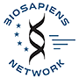

DAS workshop March 9th-11th 2009 Genome Campus, Hinxton
=======================================================

Day 1
-----

| Time          | ProjectName                                                                                       | Speaker                    | Presentation |
|---------------|---------------------------------------------------------------------------------------------------|----------------------------|--------------|
| 09:30 - 10:00 | Arrival - Tea, Coffee.                                                                            |                            |              |
| 10:00         | Opening talk                                                                                      | Tim Hubbard                |              |
| 10:20         | Collaborative Annotation tool (MaDAS)                                                             | Victor de la Torre         |              |
| 10:40         | Jalview / VAMSAS                                                                                  | Jim Procter / Geoff Barton |              |
| 11:00         | Pfam                                                                                              | Rob Finn                   |              |
| 11:20         | DASgenexp                                                                                         | Bernat Gel                 |              |
| 11:40         | Dasty2                                                                                            | Rafael Jimenez             |              |
| 12:00         | EMBOSS as an efficient DAS annotation source                                                      | Peter Rice, Mahmut Uludag  |              |
| 12:15-13:30   | Lunch break                                                                                       |                            |              |
| 13:30         | Ensembl                                                                                           | James Smith                |              |
| 13:50         | Integration of info on gene expression and its temporal and spatial localization                  | Jose Ramon Macias          |              |
| 14:10         | DAS - writeback                                                                                   | Gustavo Salazar            |              |
| 14:30         | Interaction DAS                                                                                   | Hagen Blankenburg          |              |
| 14:50         | DAS for ENCODE data coordination                                                                  | Felix Kokocinski           |              |
| 15:10-15:30   | coffee break                                                                                      |                            |              |
| 15:30         | A web resource for selecting epitopes for antibodies                                              | Niall Haslam               |              |
| 15:50         | DAS Searches                                                                                      | Andreas Prlic              |              |
| 16:10         | A karyotype DAS client                                                                            | Rafael Jimenez             |              |
| 16:30         | DASher, a standalone Java client for DAS protein sequence features                                | David Messina              |              |
| 16:50         | Data Federation - BioMart & DAS                                                                   | Syed Haider                |              |
| 17:10         | Trellis DAS2 framework- which includes the DAS1--&gt;DAS2 proxy and alpha UCSC DAS2 server        | Gregg Helt                 |              |
| 17:30         | Discussion/talk about activity organisation of next day - preliminary groups and chairs of groups |                            |              |
||

Day 2
-----

| Time          | Title                                                                                                                                          | Speaker                                                                                    | Resources                                                                                                  |
|---------------|------------------------------------------------------------------------------------------------------------------------------------------------|--------------------------------------------------------------------------------------------|------------------------------------------------------------------------------------------------------------|
| 09:15 - 10:00 | DAS - Technical Introduction                                                                                                                   | Phil Jones                                                                                 | Presentation:                                                                                              
                                                                                                                                                                                                                                                               [Powerpoint](http://www.ebi.ac.uk/~pjones/DAS2008/DAS-technical-introduction.ppt)                           
                                                                                                                                                                                                                                                               [Open Document Format](http://www.ebi.ac.uk/~pjones/DAS2008/DAS-technical-introduction.odp)                 
                                                                                                                                                                                                                                                               [PDF](http://www.ebi.ac.uk/~pjones/DAS2008/DAS-technical-introduction.pdf)                                  |
| 10:00 - 10:35 | DAS Introductory Tutorial - DAS servers and the DAS Registration Service                                                                       | Phil Jones                                                                                 | [ Introductory Tutorial](/wiki/DASworkshop200802:intro_tutorial "wikilink")                                      |
| 10:35 - 11:15 | DAS - Client Demonstration: Ensembl, grouping and histograms                                                                                   | Eugene Kulesha                                                                             |                                                                                                            |
| 11:15 - 11:40 | Coffee break                                                                                                                                   |
| 11:40 - 12:10 | Dasty2                                                                                                                                         | Rafael Jimenez                                                                             |                                                                                                            |
| 12:10 - 12:40 | SPICE, Mapping features on 3D, viewing alignments                                                                                              | Andreas Prlic                                                                              | [ SPICE links](/wiki/DASworkshop200802:spice "wikilink")                                                         |
| 12:40 - 13:40 | Lunch break                                                                                                                                    |
| 13:40 - 14:10 | Pepper                                                                                                                                         | Jose Ramon Macias                                                                          | [<http://biocomp.cnb.csic.es/das>](http://biocomp.cnb.csic.es/das)                                         |
| 14:10 - 15:10 | DAS: Setting Up Your Own Server. In this section the group will split into two tracks - one for Perl programmers and one for Java programmers. | [Proserver](http://www.sanger.ac.uk/Software/analysis/proserver): Andy Jenkinson           
                                                                                                                                                                  [Dazzle](http://www.biojava.org/wiki/Dazzle): Andreas Prlic                                 | [ProServer: writing a SourceAdaptor](http://www.ebi.ac.uk/~aj/das_workshop_2008/proserver_tutorial.html)   
                                                                                                                                                                                                                                                               [Dazzle: using existing plugins](http://www.biojava.org/wiki/Dazzle:plugins)                                
                                                                                                                                                                                                                                                               [Dazzle: writing a plugin](http://www.biojava.org/wiki/Dazzle:writeplugin)                                  
                                                                                                                                                                                                                                                               [Chromosome 21 GFF File](http://www.ebi.ac.uk/~pjones/DAS2008/chr21.gff)                                    |
| 15:10 - 15:30 | Coffee break                                                                                                                                   |
| 15:30 - 16:30 | DAS - Coding a Client.                                                                                                                         | [Bio::Das::Lite](http://search.cpan.org/~rpettett/Bio-Das-Lite/) (Perl) - Andy Jenkinson   
                                                                                                                                                                  [Dasobert](http://www.spice-3d.org/dasobert/) (Java) - Andreas Prlic                        | [Bio::Das::Lite tutorial](http://www.ebi.ac.uk/~aj/das_workshop_2008/daslite_tutorial.html)                |

