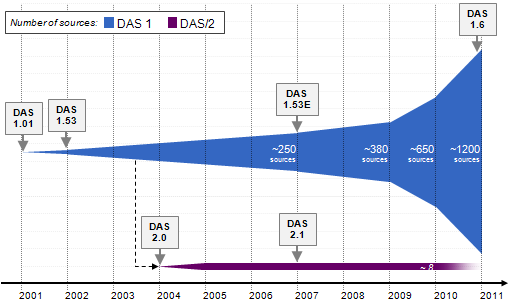

<big>**Welcome To BioDAS.org**</big>

About DAS
---------

The <b>Distributed Annotation System</b> (DAS) defines a communication
protocol used to exchange
[annotations](http://en.wikipedia.org/wiki/Genome_project#Genome_annotation)
on genomic or protein sequences. It is motivated by the idea that such
annotations should not be provided by single centralized databases, but
should instead be spread over multiple sites. Data distribution,
performed by DAS servers, is separated from visualization, which is done
by DAS clients. The advantages of this system are that control over the
data is retained by data providers, data is freed from the constraints
of specific organisations and the normal issues of release cycles, API
updates and data duplication are avoided.

DAS is a client-server system in which a single client integrates
information from multiple servers. It allows a single machine to gather
up sequence annotation information from multiple distant web sites,
collate the information, and display it to the user in a single view.
Little coordination is needed among the various information providers.

DAS is heavily used in the genome bioinformatics community. Over the
last years we have also seen growing acceptance in the protein sequence
and structure communities.

What can I do with DAS ?
------------------------

A DAS-enabled website or application can aggregate complex and
high-volume data from external providers in an efficient manner. For the
biologist, this means the ability to "plug in" the latest data, possibly
including a user's own data. For the application developer, this means
protection from data format changes and the ability to add new data with
minimal development cost.

Here are some examples of DAS-enabled applications or websites for end
users:

-   [Dalliance](http://www.biodalliance.org/human/ncbi36/) Experimental
    Web/Javascript based Genome Viewer
-   [IGV](http://www.broadinstitute.org/igv/) Integrative Genome Viewer
    java based browser for many genomes
-   [Ensembl](http://www.ensembl.org/info/data/ensembl_das.html) uses
    DAS to pull in genomic, gene and protein annotations. It also
    provides data via DAS.
-   [Gbrowse](http://www.gmod.org/gbrowse_installation) is a generic
    genome browser, and is both a consumer and provider of DAS.
-   [IGB](http://genoviz.sourceforge.net) is a desktop application for
    viewing genomic data.
-   [SPICE](http://www.efamily.org.uk/software/dasclients/spice/) is an
    application for projecting protein annotations onto 3D structures.
-   [Dasty2](http://www.ebi.ac.uk/dasty/) is a web-based viewer for
    protein annotations
-   [Jalview](http://www.jalview.org) is a multiple alignment editor.
-   [PeppeR](http://biocomp.cnb.uam.es/das/PeppeR/) is a graphical
    viewer for 3D electron microscopy data.
-   [DASMI](http://www.dasmi.de) is an integration portal for protein
    interaction data.
-   [DASher](http://dasher.sbc.su.se) is a Java-based viewer for
    protein annotations.
-   [EpiC](http://epic.embl.de) presents structure-function summaries
    for antibody design.
-   [STRAP](http://www.bioinformatics.org/strap/) is a STRucture-based
    sequence Alignment Program.

Hundreds of DAS servers are currently running worldwide, including those
provided by the [European Bioinformatics
Institute](http://www.ebi.ac.uk/), [Ensembl](http://www.ensembl.org/),
the [Sanger Institute](http://www.sanger.ac.uk/),
[UCSC](http://genome.ucsc.edu/), [WormBase](http://www.wormbase.org/),
[FlyBase](http://www.flybase.org/), [TIGR](http://www.tigr.org/), and
[UniProt](http://www.ebi.ac.uk/uniprot-das/). For a listing of all
available DAS sources please visit the
[DasRegistry](/wiki/DasRegistry "wikilink").

Versions of DAS
---------------

The original DAS specification was written by Lincoln Stein, Sean Eddy,
and Robin Dowell. It is widely adopted and well supported, particularly
throughout Europe, and is the basis for a large number of existing
clients and servers. The protocol has been developed incrementally since
its inception and thus there are several successive versions of the
specification, each expanding on the last whilst retaining a focus on
backwards compatibility. The current specification of DAS is version
[1.6](http://www.biodas.org/documents/spec-1.6.html).

Though mature, the protocol continues to be extended to cater for the
needs of the DAS community via extensions to the specification.
Together, these extensions form an "extended specification". The current
version is [1.6E](/wiki/DAS1.6E "wikilink").

<b>NOTE:</b> The DAS/2 project is an entirely separate specification
which although based on the DAS architecture is not backwards compatible
with existing servers and clients. It is described separately on the
[DAS/2](/wiki/DAS/2 "wikilink") page.

The various specification versions on this site are described
[here](/wiki/DAS_specification "wikilink").

  
**Evolution**

Graphic representation of the evolution of "Versions of DAS" over the
years. The different colors identify the version/specification and the
white numbers an estimation of available sources per year.

Further Reading
---------------

If you would like to find out more, see a description of the [DAS
protocol](/wiki/DAS/1 "wikilink"). Additional information is also available in
the form of an [FAQ](/wiki/DasFAQ "wikilink") page, and a more extensive
reference: [Everything DAS](/wiki/Everything_DAS "wikilink"). There is also a
list of DAS related [publications](/wiki/DAS_publications "wikilink").

The [Community Portal](/wiki/BioDAS:Community_Portal "wikilink") page contains
information on the various DAS mailing lists.

DAS is often represented in workshops, training courses and conferences.
A list of past and future events is available on the [Current
events](/wiki/Current_events "wikilink") page.

Contribute to this Wiki
-----------------------

Want to contribute to the Wiki? please see some beginners instructions
at the [WikiGetStarted](/wiki/WikiGetStarted "wikilink") page.
